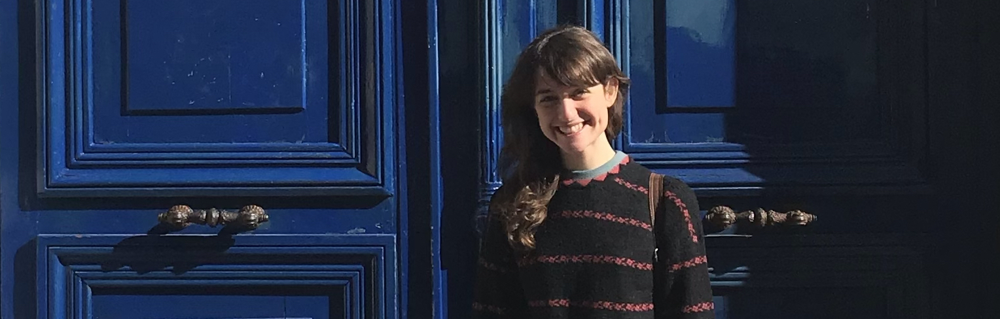

 

<q style="font-size:18px; margin:0">  Preserving the spirit of childood for life means preserving the curiosity of learning, the pleasure to understand, the desire to communicate. <small style="font-size:12px;margin-bottom:0"> </q>  (translated from Bruno Munari) </small> 
  

 I am a PhD candidate in <b> Statistics </b> at the University of California Irvine, jointly advised by <a href="https://www.ics.uci.edu/~sudderth/"> <b> Erik Sudderth </b> </a> and <a href ="https://www.micheleguindani.info/" > <b> Michele Guindani </b> </a>. My research focuses on developing Bayesian models for the analysis of networks and for clustering multivariate time-series data.  

 I also work on projects in <b> statistics and data science education, </b> with <a href="https://www.minedogucu.com/"> Mine Dogucu </a> as my 'honorary advisor'. I created the R package <a href="https://federicazoe.github.io/gradetools/"> gradetools </a> to assist data science instructors with providing grades and feedback to their students. I developed [an activity](https://federicazoe.github.io/bayes-games/) for teaching Bayesian modeling via gamification, teamwork and data collection. 

### News 

- August 2024. I am attending [JSM](https://ww2.amstat.org/meetings/jsm/2024/index.cfm), where I am presenting on the [Bayes BATS](https://www.stat.uci.edu/bayes-bats/) program and participating in the [Preparing to Teach](https://preparingtoteach.org/) workshop.

- July 2024. I am mentoring a team of four undergraduate students participating in the [ISI-BUDS](https://www.stat.uci.edu/isi-buds/) program, together with [Tetyana Vasylyeva](https://publichealth.uci.edu/faculty/vasylyeva-tetyana/) and [Volodymyr Minin](https://vnminin.github.io/).

- July 2024. I am giving an invited talk at the world meeting of the [International Society for Bayesian Analysis](https://bayesian.org/), about my research on [Bayesian temporal biclustering with applications to multi-subject neuroscience studies](https://arxiv.org/abs/2406.17131).

- July 2024. Our paper on [Automated grading workflows for providing personalized feedback to open-ended data science assignments](https://escholarship.org/uc/item/8ck097s5) has been published on the journal Technology Education in Statistics Education.

- June 2024. Our breakout session [Building Data Science Education Research Plan for Teacher-Scholars](https://mdogucu.github.io/eCOTS-2024/#/title-slide) was voted the hot-topic of the day at [eCOTS](https://www.causeweb.org/cause/ecots/ecots24/program/breakout/building-data-science-education-research-plan-for-teacher-scholars).

- June 2024. I am presenting a poster about teaching Bayesian modeling using an online racing game at [eCOTS](https://www.causeweb.org/cause/ecots/ecots24/program/posters/19) and at [BAYSM](https://drive.google.com/drive/search?q=bayes%20games). Check out the activity [here](https://federicazoe.github.io/bayes-games/)!

